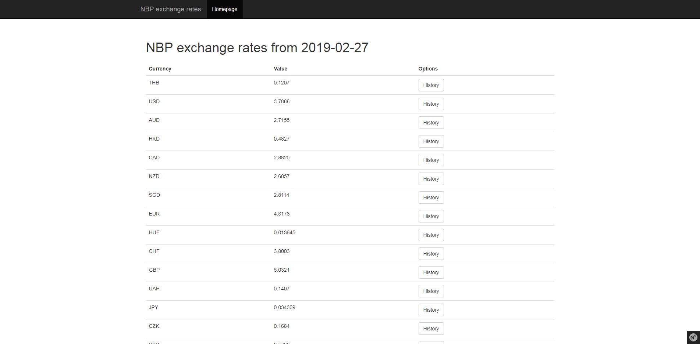
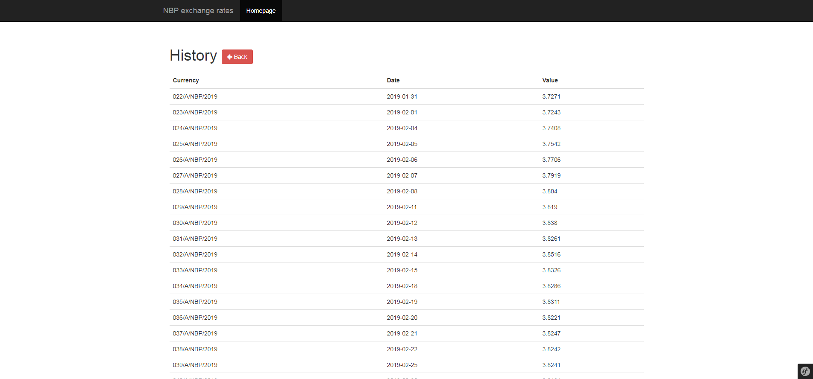

## Table of contents
* [General info](#general-info)
* [Technologies](#technologies)
* [Features](#features)
* [Screenshots](#screenshots)

## General info
Simple Symfony program obtaining current exchange rates from nbp api
	
## Technologies
Project is created with:
* Symfony 3.4
* Guzzlehttp/guzzle 6.3

## Features
* Obtaining exchange rates for current day
* Displaying historical currency rates

## Screenshots
**Main page**

**History**

